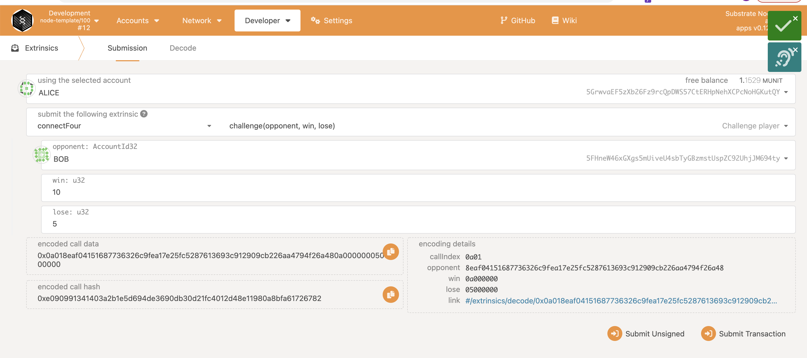
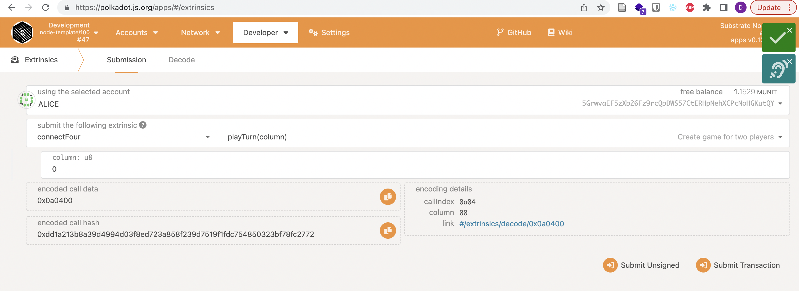
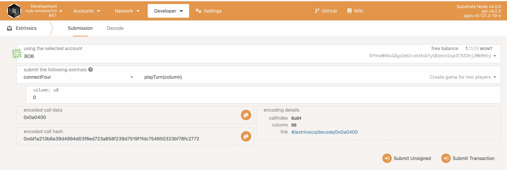
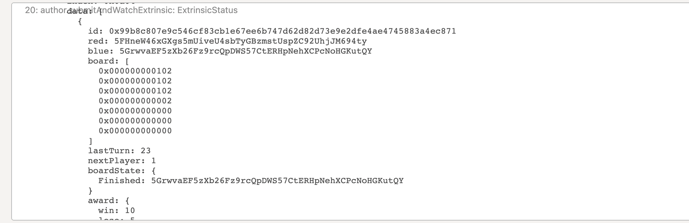
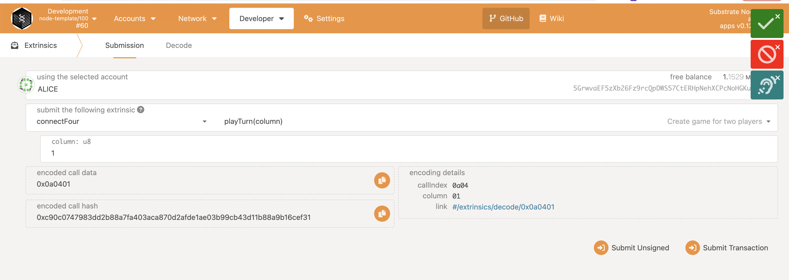

# Balances Module

The Connect-four module provides functionality for connect four gameplay logic.

## Overview

The Connect-four module provides functions for:

- Challenge and accept challenge to/from different users.
- Create game board.
- Play with turns.
- Find random game.

## Dispatchable Functions

- `find_game` - Find random game  within a certain range of point diff.
- `cancel_queue` - Remove account from matching queue.
- `challenge` - Challenge other users.
- `resp_challenge` - Response to the challenge.
- `cancel_challenge` - Remove the old challenge.
- `play_turn` - Play the game in turns.
## Results

The following examples show how the game occurs using [this](https://polkadot.js.org/apps).

### Challenge process

Start challenge

Respond to challenge

Both users join the same board game

Cancel old challenge

### Game play in turns

Alice's turn

Bob's turn

Game state between turns

Alice makes wrong turn

Game's result

### Find random game

Alice finds

Bob finds

Not match condition so Alice and Bob can't start a new game

Charlie finds

Match condition and start a new game

